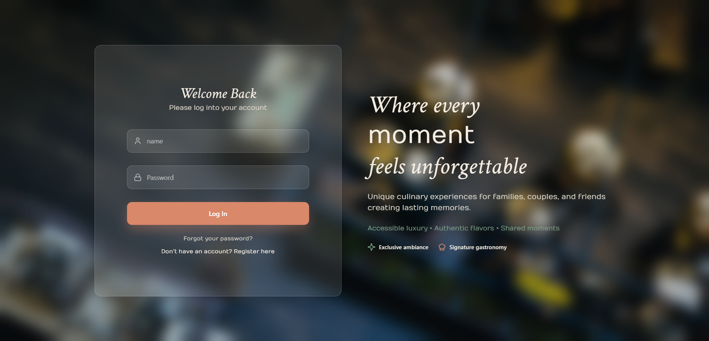
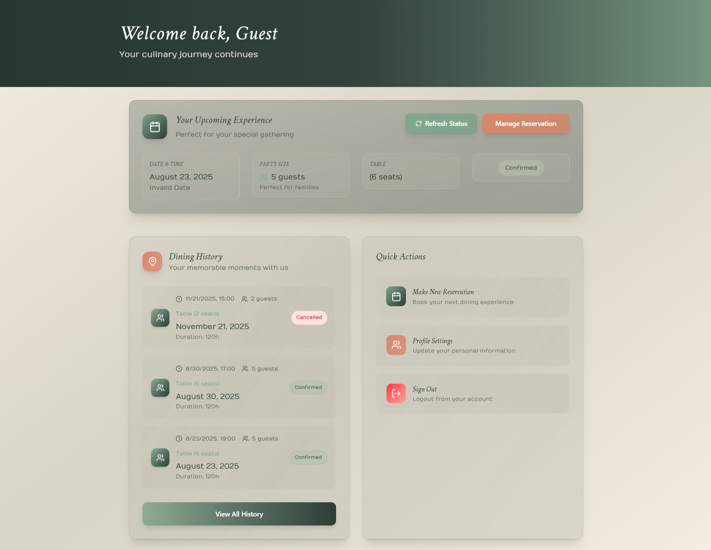
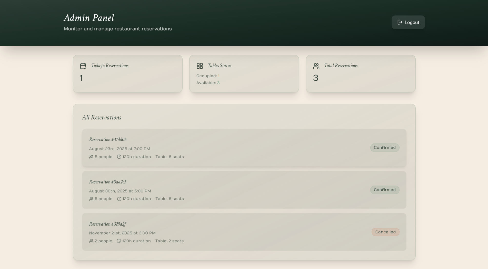

# Restaurant Reservation System (MERN Stack)

This project is a **restaurant reservation system** built with the **MERN stack** (MongoDB, Express, React, Node.js).  
It includes authentication, role-based access control, reservations management, and separate dashboards for users and administrators.  

The project is designed to be scalable and will continue to grow with new features and improvements over time. 🚀

---

## Features

- **Authentication & Authorization**
  - Signup, Login, and JWT-based authentication
  - Role-based access (User / Admin)

- **User Features**
  - Make a reservation
  - View personal reservations
  - Edit or cancel reservations

- **Admin Features**
  - Dashboard to manage reservations
  - Manage tables
  - Update reservation status

- **Responsive UI**
  - Separate dashboards for Users and Admins
  - Built with React Router for client-side navigation

---

## Project Structure
/project-root
├── back/ # Backend (Express + MongoDB)
├── front/ # Frontend (React)
├── assets/ # Images, screenshots, etc.
│ └── screenshots/
│ ├── landing.png
│ ├── login.png
│ ├── register.png
│ ├── dashboard-user.png
│ ├── dashboard-admin.png
├── README.md

## Screenshots

### Landing Page

### Login

### Register

### User Dashboard

### Admin Dashboard

---

## Installation & Setup

### 1. Clone the repository
git clone https://github.com/EmiLzLz/Restaurant-Reservation-System---MERN-Stack.git
cd restaurant-reservations_system

### 2.Backend Setup
cd resevations_backend
npm install

* Create a .env file inside /back with:
MONGO_URI=your_mongodb_connection_string
JWT_SECRET=your_jwt_secret

* Run the backend:
node index.js

### 3. Frontend Setup
cd ../front
npm install
npm run dev

---

## Future plans
This project will continue to expand with more functionality and improvements over time. ✨

---

## License

This project is licensed under the MIT License.
